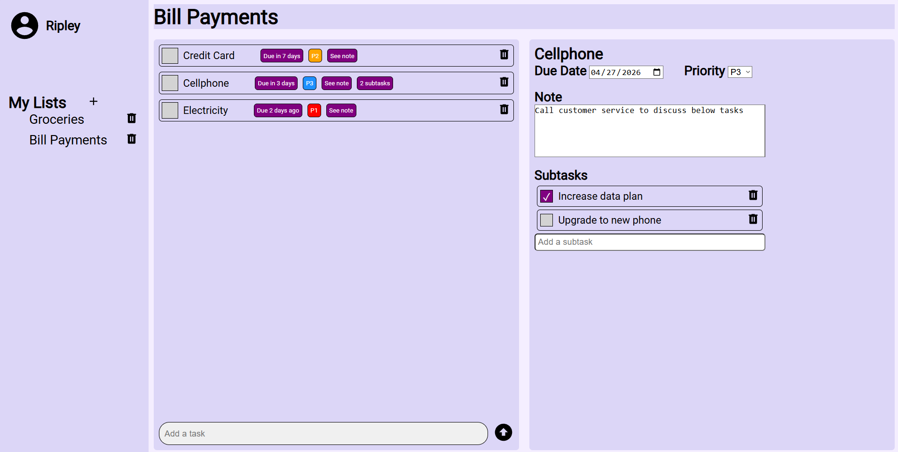

# Todo List
Fully interactive Todo List application built from scratch using HTML, CSS, and JavaScript. 

This is part of [The Odin Project's Full Stack Javascript path](https://www.theodinproject.com/paths/full-stack-javascript) and brings together, among other concepts, modular JavaScript, OOP factory functions, DOM manipulation, and webpack bundling.  

## Screenshot


## Installation
1. Clone the repository
2. Navigate to the project folder: ```cd todo-list```
3. Install dependencies: ```npm install```
4. Build the project: ```npx webpack```
5. Navigate to dist folder: ```cd dist```
6. Open index.html in any modern browser

## Live Demo
A live demo is available here: [Todo List](https://keegan-george.github.io/todo-list/)

## Features
- Create, modify, and delete tasks
- Add tasks to any list
- Add subtasks to any task
- Priority badges (P1 - P4)
- Optional notes
- Due date tracking
- Dynamic UI rendering
- Modular JavaScript architecture
- Persistent storage using localStorage
- Custom CSS design
- Webpack bundling

## Technologies
- HTML5
- CSS (custom styling)
- JavaScript (module pattern, factory functions, event delegation, DOM manipulation)
- Webpack (bundling)

## Fonts
- [Roboto](http://fonts.google.com/specimen/Roboto)

## Images
- Account icon: [account-circle](https://pictogrammers.com/library/mdi/icon/account-circle/)
- Arrow Up Submit icon: [arrow-up-bold-circle](https://pictogrammers.com/library/mdi/icon/arrow-up-bold-circle/)
- New List Plus icon: [plus](https://pictogrammers.com/library/mdi/icon/plus/)
- Trash Can: [trash-can](https://pictogrammers.com/library/mdi/icon/trash-can/)

